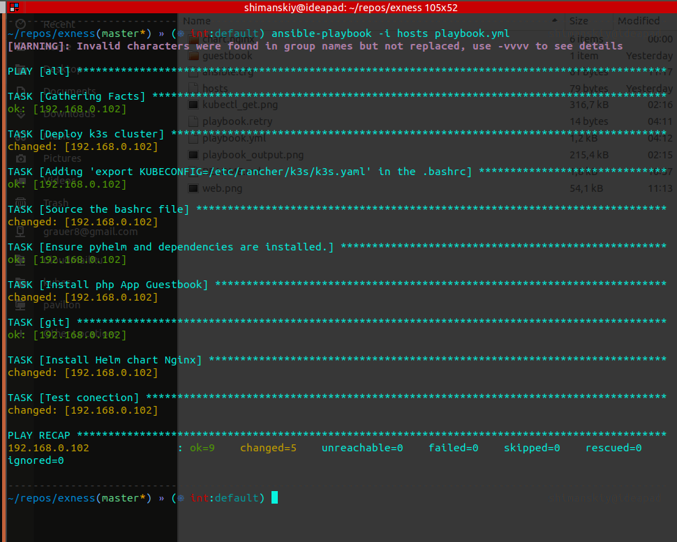

### Task:
- Deploy a Kubernetes cluster
- Containerization environment: K3s or GKE or EKS
- Linux operating system
- Web server: Nginx-any
- Backend: Php
- Balancer: any

Write a script that will deploy the containerization environment, launch a web server with nginx in it, and configure the PHP backend to accept requests. The script after the launch web server and the backend should check their availability using the balancer ports.

### Deploying:
- Before deploying the project, you should to edit inventory file `hosts`, specify the appropriate IP addresses in it.
- For ingress balancer working should to specify appropriate domain name in `chart.nginx/values.yaml` in `serverBlock:` and `ingress:`.
- Also appropriate A-record should be present in DNS or /etc/hosts. For example: `192.168.0.102	exness.local`
- Then execute playbook:
```
ansible-playbook -i hosts -b playbook.yml
```


Components:
- Orchestration: K3S Lightweight Kubernetes
- LB: Traefik Ingress Controller
- Frontend: Nginx Helm chart
- Backend: PHP application Guestbook
- Database: Redis cluster


### Задача:
Развернуть kubernetes-кластер
Среда контейнеризации: K3s or GKE or EKS
Операционная система: Linux
Веб-сервер: Nginx - any
Backend: Php
Балансировщик: any

Написать скрипт, который развернет среду контейнеризации, запустит в ней веб-сервер Nginx и настроит бекенд Php для приема запросов. Скрипт после запуска веб-сервера и бекенда, должен проверить их доступность, используя порты балансировщика.
